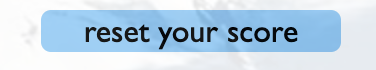

# Mountain Hangaman 

## ABOUT THE PROJECT

Mountain hangman is an unreal project created for my PP2  project with Code Institute. Mountain Hangman is a website which is a simple hangman style game that can be played with an interactive keyboard.

## ABOUT THE WEBSITE

The Web site is a simple 1 page website that allows users to play the hangman game easily. It contains a hidden word, a tnt picture with a fuse that changes when a wrong letter is guessed and an interactive keyboard.

## INDEX

User Experience

Designs

Technology used

Features

Testing

Deployment

Credits

User experience

Strategy

## Reasons for this website:

To learn the names of famous mountians
for people to enjoy playing a game 

##Reasons a user may visit the website:

To learn the names of famous mountians
To enjoy playing a game 

## SCOPE

## What a user may expect:

smooth interactivity
a fun game
interesting graphics
to know when they have lost
to know when they have won

## What a user may want:

a working keyboard
a way of keeping score
a way of knowing how many guesses they have left
a way to reset the whole game so they can play again

## STRUCTURE

The 1 page website contains: 
* simple instructions telling you how to play the game
* an image that changes everytime a wrong letter has been guesssed
* a word that has been hidden by dashes that needs to be guessed
* a keyboard that reveals a correct letter in the dashes when it has ben pressed
* a score that updates when a game has been won
* a mistakes score that updates everytime an incorrect letter has been guessed
* an alert message that appeas if you have won a game
* a loosing alert to tell you if you have lost a game

## COLOR SCHEME

The color scheme is based on the colours you would see on a snowy mountain. The colours are a simple blue and white and the writing is a simple black, which is clear and easy to read.

## TYPOGRAPHY

The font 'Indie Flower', was used for the main body of the web site. This font is playful and adds to the frivolity of the game. For the buttons I used Gill Sans as it is easy to read. 

## TECHNOLOGIES USED

Languages used:

* HTML5
* CSS
* JavaScript

Libraries and programs used:

* Google Fonts: Was used to import fonts
* Sweetalerts: to add design to the alerts
* Compress to go was used to compres large image sized
* Cloud convert used to convert jpeg files to webp files
* Git: Was used for version control by employing the Gitpod terminal to commit to Git and Push to GitHub.
* GitHub: Was used as the repository for the project's code after being pushed from Git.
* canva.com to create the tnt image

## FEATURES

   
Hangman/tnt image
central to the game is the changing hangman image. 
This image consists of a tnt block with a fuse. I used a playful image that was related to mountains which gave a clear visual representation of how many goes the player has left

Mountain words
These appear randomly  from an array of famous mountain names. 
The word is then hidden with dashes. Each dash represents a letter 

Mistakes score
this is updated by 1 every time the player chooses a letter that is not in the word.
when the game is finished the mistakes score goes back to 0

Score
This goes up by 1 each time the player guesses the correct word.
the score stays the same even when the page is refreshed ready for the next game

    
reset button
the reset button can be pressed if the player would like to start fresh.
it resets the whole score and the mistakes button

alerts
A 'you've won' alert appears when the word has been correctly guesssed
a 'you've lost' alert appears when the player has not guessed the word in under 7 guesses. This alert is delayed my 2 seconds to allow the player the oppportunity to see the final 'explosion image'

## breakpoints

@ media queries for
From 700px devices

From 1100px devices

## Testing

VALIDATORS
Html validation
Passed all checks

Css validation 
passed all checks

BROWSERS

I tested how the website looked in different browsers. Firefox was the main browser. I used dev tools to resize the screen. I also wrote text on all pages on a range of devices. This worked well and I had no issues.

Google Chrome Version 107.0.5304.87 (Official Build) (arm64)

Mozilla Firefox 106.0.3 (64-bit)

LIGHTHOUSE

I used Lighthouse for testing: Performance, Best Practices, Accessibility, and SEO.

The game scored high on everyting apart from SEO it scored 84
the issues were the gaps between the buttons and the website not containing meta data.

## Testing grid

|test action|expected outcome|outcome 
|-----------|--------------|----------------------
|work on firefox  | no issues  |pass | |
|work on safari            |  no issues         |    pass            |         |
|work on chrome            |     no issues      |    pass            |         |
|functional on 1500px            |  fit to screen         |  pass              |functional on 800px|     fit to screen            |   pass     |           |       |
|functional on 500px|       fit to screen    |    pass            |         |
|do all the images appear when loading           | all pics load          |   pass  |           |does a random word appear hidden by dashes? |    
|does the keyboard register the letters             | all letters register the letter on the button          | pass            |are the letters disabled when pressed?       |
|does a letter appear when in the word           | letter appears on the dashes array when correct           |  pass  |            |does the image change when a wrong letter is pressed?|   |pass
|is the wong score updated when a wrong word is pressed?      |score updates by 1|    pass  |is the score updated when a correct answer is guessed?    |pass        |         |does alert come when correct word guessed|    |pass     |
|does alert come after 7 wrong letters guessed?        |sweet alert pops up after a delay to show explosion  |pass        |does the score stay after a won game?         |     |pass
|does the reset button reset the whole game? |reset button clears all letters on the guess board and sets wrong score and score to 0           |     pass    |       |         |
|are the letters disabled when pressed?             |all letters grey out and can not be pressed again           |  pass              |         |
|does the image change when a wrong letter is pressed?             |the image moves on to the next image in the array           |        pass  |      |         |    |    |    | 
   |is the score updated when a correct answer is guessed?    |the score updates by 1 when a score is guessed correctly    |pass    |   |   
 |does alert come when correct word guessed         | alert appears saying you have won   | pass   |    | 
 |reset button clears all letters on the guess board and sets wrong score and score to 0          |reset button resets the whole game    | pass   | 

    
## ISSUES DURING TESTING

During testing I realised that not all of the game was visible during the mobile view. I changed the breakpoint and the size of the font as well as the size of the refresh button.

I also realised that the font was far too small for the desktop view and changed the size for a desktop.

During the javascript validation I realised that I had not changed a function that I had renamed. I gave the function the appropriate name

I also discovered I was not using the variable 'letter' and I deleted it. 

During testing I realised that my buttons were too close together for a mobile. I changed the size of the gap between them to make them more accessible.

During testing I realised that, although there were no commas between the dashes for the initial word, when a letter was guessed commas appeared. I changed the position of my.join to solve this.

During testing my tnt images would change after 1 wrong guess. After this the images would stay the same. I realised the index++ variable was set as a local variable. I changed to global, which corrected the mistake. 

## DEPLOYMENT

HOW THIS SITE WAS DEPLOYED

Go to the Git hub repository and click on settings
On the left hand menu click on pages
On the main page on the branch section click 'main' and save
The page should now be available on the github pages section above

HOW TO CLONE THIS SITE

Go to Git hub and navigate to the main page of the repository
On the menu , click Code.
Select and copy https://github.com/robinoldman/mountain-hang-man
Change the current working directory to the location where you want the cloned directory.
type git clone, and then paste the URL you copied earlier.

FORKING

Forking the GitHub Repository

By forking the GitHub Repository, you can make a copy of the original repository in your own GitHub account. This means we can view or make changes without making the changes affecting the original.

Log into GitHub and locate the GitHub Repository.
At the top of the Repository there is a "Fork" button about the "Settings" button on the menu.
You should now have a new copy of the original repository in your own GitHub account.

## CREDITS

CODE
I used https://www.google.com/search?client=firefox-b-d&q=hangman+in+javascript+tutorial#fpstate=ive&vld=cid:6a7bfb36,vid:dgvyE1sJS3Y
as a rough guide for the layout of the game. 
I used https://www.youtube.com/watch?v=N3cq0BHDMOY
to help me create a keyboard
I used the code provided from https://sweetalert2.github.io/
for the designed alert
   
## MEDIA
The background image was from https://www.freepik.com

### ACKNOWLEDGMENTS

My mentor Brian Macharia helped me through many issues and hurdles along the way with expert advice on my CSS and HTML. My Brother Patrick Oldman also supported me and recommended tutorials to watch online to help with any issues.

### Disclaimer

The content of this Website is for educational purposes only.